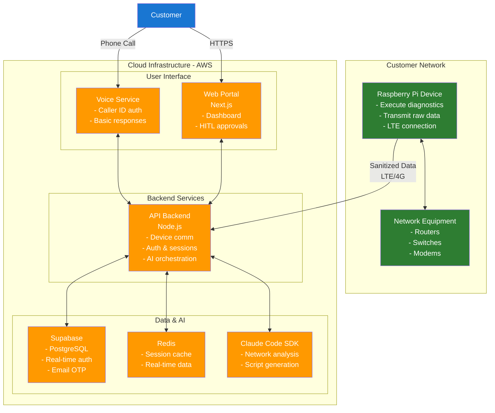

# Zen & Zen Network Support - System Architecture

## Executive Summary

The Zen & Zen Support system implements a "hands on-prem, brains in-the-cloud" architecture to deliver AI-powered network diagnostics and remediation. The MVP focuses on a simple, subscription-based service ($99/month per location) targeting SMBs with common network issues, achieving sub-30-minute resolution times through secure multi-modal interactions.

## Architecture Overview

The system consists of three main layers:

1. **Device Layer**: Raspberry Pi hardware with LTE connectivity that collects raw network diagnostic data and transmits it securely to cloud
2. **Cloud Services**: Simple API backend with AI orchestration, authentication, and web portal
3. **User Interface**: Multi-modal experience combining voice calls with a secure web portal for approvals

The architecture prioritizes security (MFA + HITL approval), simplicity (minimal service count), and MVP functionality over premature scaling optimizations.

## Service Definitions

### Core Services (MVP)

**Device Agent** (Raspberry Pi)
- Execute network diagnostic commands locally
- Collect and transmit raw diagnostic data to cloud
- Manage secure LTE connection to cloud
- Handle multi-color LED status indication
- Execute approved remediation scripts

**API Backend** (Single Node.js Service)
- REST endpoints for device communication
- Authentication via Supabase (Caller ID + Email OTP)
- Real-time WebSocket connections for portal updates
- AI orchestration with Claude Code SDK
- Voice service integration

**Web Portal** (Next.js)
- Customer dashboard with network status
- HITL approval interface for remediation actions
- Real-time diagnostic progress display
- Audit trail for all actions

**Voice Service** (Basic Phone Integration)
- Inbound call handling with Caller ID verification
- Simple voice responses during diagnostic process
- Coordinate with web portal for user approvals

## API Contracts

### Device Communication

**POST /api/device/register**
```json
Request:
{
  "deviceId": "pi_abc123",
  "serialNumber": "RPI4B-12345",
  "networkInfo": {
    "interfaces": ["eth0", "wlan0"],
    "defaultGateway": "192.168.1.1"
  }
}

Response: 200 OK
{
  "status": "registered",
  "sessionId": "sess_xyz789",
  "cloudEndpoint": "wss://api.aaanet.support/ws"
}
```

**POST /api/device/diagnostic**
```json
Request:
{
  "sessionId": "sess_xyz789",
  "diagnosticData": {
    "pingTests": [{"host": "8.8.8.8", "latency": 25, "packetLoss": 0}],
    "interfaceStatus": {"eth0": "up", "wlan0": "down"},
    "sanitized": true
  }
}

Response: 200 OK
{
  "analysis": "Network connectivity appears normal to external hosts",
  "nextActions": ["check_local_dns", "verify_dhcp_lease"],
  "requiresApproval": false
}
```

### User Authentication

**POST /api/auth/verify-caller**
```json
Request:
{
  "phoneNumber": "+15551234567",
  "callerId": "+15551234567"
}

Response: 200 OK
{
  "otpSent": true,
  "sessionId": "auth_abc123"
}

Error: 401 Unauthorized
{
  "error": "Caller ID mismatch",
  "code": "CALLER_ID_INVALID"
}
```

### Remediation Approval

**POST /api/remediation/approve**
```json
Request:
{
  "sessionId": "sess_xyz789",
  "actionId": "action_def456",
  "approved": true,
  "userNote": "Approved router restart"
}

Response: 200 OK
{
  "status": "approved",
  "executionStarted": true,
  "estimatedDuration": "2 minutes"
}
```

## Data Schema

### Primary Database (PostgreSQL via Supabase)

```sql
-- Customers table
CREATE TABLE customers (
  id UUID PRIMARY KEY DEFAULT gen_random_uuid(),
  business_name VARCHAR(255) NOT NULL,
  primary_phone VARCHAR(20) NOT NULL UNIQUE,
  subscription_status VARCHAR(20) DEFAULT 'active',
  created_at TIMESTAMP WITH TIME ZONE DEFAULT NOW(),
  updated_at TIMESTAMP WITH TIME ZONE DEFAULT NOW()
);

-- Devices table
CREATE TABLE devices (
  id UUID PRIMARY KEY DEFAULT gen_random_uuid(),
  customer_id UUID REFERENCES customers(id),
  device_id VARCHAR(50) NOT NULL UNIQUE,
  serial_number VARCHAR(50) NOT NULL UNIQUE,
  status VARCHAR(20) DEFAULT 'inactive',
  last_seen TIMESTAMP WITH TIME ZONE,
  network_config JSONB,
  created_at TIMESTAMP WITH TIME ZONE DEFAULT NOW()
);

-- Sessions table
CREATE TABLE diagnostic_sessions (
  id UUID PRIMARY KEY DEFAULT gen_random_uuid(),
  customer_id UUID REFERENCES customers(id),
  device_id UUID REFERENCES devices(id),
  caller_phone VARCHAR(20) NOT NULL,
  status VARCHAR(20) DEFAULT 'initiated',
  diagnostic_data JSONB,
  remediation_actions JSONB[],
  resolution_time_minutes INTEGER,
  created_at TIMESTAMP WITH TIME ZONE DEFAULT NOW(),
  completed_at TIMESTAMP WITH TIME ZONE
);

-- Audit log for all actions
CREATE TABLE audit_log (
  id UUID PRIMARY KEY DEFAULT gen_random_uuid(),
  session_id UUID REFERENCES diagnostic_sessions(id),
  action_type VARCHAR(50) NOT NULL,
  action_details JSONB NOT NULL,
  user_approved BOOLEAN DEFAULT false,
  executed_at TIMESTAMP WITH TIME ZONE DEFAULT NOW()
);

-- Indexes for performance
CREATE INDEX idx_devices_customer ON devices(customer_id);
CREATE INDEX idx_sessions_customer ON diagnostic_sessions(customer_id);
CREATE INDEX idx_sessions_status ON diagnostic_sessions(status);
CREATE INDEX idx_audit_session ON audit_log(session_id);
```

### Cache Layer (Redis)

```json
// Session state cache
"session:{sessionId}" = {
  "customerId": "uuid",
  "deviceId": "uuid", 
  "status": "in_progress",
  "currentStep": "network_diagnostics",
  "voiceCallActive": true,
  "webPortalConnected": true,
  "ttl": 3600
}

// Authentication cache
"auth:{phoneNumber}" = {
  "otpCode": "123456",
  "attempts": 1,
  "verified": false,
  "ttl": 300
}
```

## Technology Stack Rationale

**Node.js 20 LTS** - Runtime
- **Justification**: Unified language across device and cloud, excellent ecosystem for real-time applications
- **Trade-offs**: vs Python (better AI libraries) - Node.js chosen for team consistency and WebSocket support

**TypeScript 5.x** - Language
- **Justification**: Type safety reduces runtime errors, improves development velocity
- **Trade-offs**: vs JavaScript - minimal overhead for significant quality benefits

**Next.js 14** - Frontend Framework  
- **Justification**: Server-side rendering for better performance, built-in API routes, strong TypeScript support
- **Trade-offs**: vs React SPA - SSR adds complexity but improves initial load times for dashboard

**PostgreSQL via Supabase** - Database
- **Justification**: ACID compliance for audit trails, built-in auth, real-time subscriptions, managed service
- **Trade-offs**: vs MongoDB - relational structure better for customer/device relationships and audit requirements

**Redis** - Cache Layer
- **Justification**: Session management, real-time data, simple data structures
- **Trade-offs**: vs in-memory caching - Redis enables horizontal scaling and persistence

**AWS ECS Fargate** - Container Orchestration
- **Justification**: Serverless containers, no cluster management, cost-effective for MVP scale
- **Trade-offs**: vs Kubernetes - less control but significantly simpler operations

**Claude Code SDK** - AI Integration
- **Justification**: Specialized for code generation and network troubleshooting, anthropic's safety focus
- **Trade-offs**: vs OpenAI - Claude better for technical reasoning and safety considerations

## Key Considerations

### Scalability
The architecture handles 10x growth through:
- **Database**: Supabase scales automatically with connection pooling
- **API**: ECS Fargate auto-scaling based on CPU/memory metrics  
- **Caching**: Redis cluster mode for horizontal scaling
- **Frontend**: CloudFront CDN handles geographic distribution
- **Bottlenecks**: AI API rate limits (mitigated by request queueing)

### Security
Primary threat vectors and mitigations:
- **Device Compromise**: Secure data transmission, outbound-only connections, immutable OS
- **Man-in-the-Middle**: Certificate pinning, TLS 1.3, VPN-like security model
- **Unauthorized Access**: Multi-factor auth (Caller ID + Email), short-lived JWT tokens
- **Data Breach**: Minimal PII storage, encryption at rest, audit logging
- **Social Engineering**: HITL approval for all state changes, clear approval interfaces

### Observability
Health monitoring and debugging approach:
- **Application Health**: Custom CloudWatch metrics for session success rates, API response times
- **Infrastructure Monitoring**: AWS native monitoring for ECS, RDS, Redis health
- **Business Metrics**: MTTR tracking, customer satisfaction correlation with session data
- **Log Aggregation**: CloudWatch Logs with structured JSON, correlation IDs across services
- **Alerting**: PagerDuty for critical issues (>5min API downtime), Slack for warnings

### Deployment & CI/CD
The system deploys through a simple pipeline:
- **Source Control**: GitHub with branch protection on main
- **Testing**: GitHub Actions runs unit + integration tests on PR
- **Build**: Docker containers pushed to AWS ECR
- **Deploy**: ECS service updates with rolling deployments
- **Rollback**: Previous container versions retained for quick rollback
- **Environments**: Single production environment initially, staging added after MVP validation

## System Architecture Diagram



## Implementation Approach

### MVP Development Phases

**Phase 1: Core Foundation (Weeks 1-3)**
- Set up single Node.js API service with Express
- Implement Supabase integration for auth and data
- Create basic Next.js web portal with dashboard
- Develop Raspberry Pi agent simulator
- Basic CI/CD with GitHub Actions

**Phase 2: AI Integration (Weeks 4-6)**
- Integrate Claude Code SDK for diagnostic analysis
- Implement device communication protocols
- Add real-time WebSocket connections
- Create HITL approval workflows
- Basic voice service integration

**Phase 3: MVP Completion (Weeks 7-8)**
- End-to-end testing and security review
- AWS deployment setup (ECS Fargate)
- Production monitoring and alerting
- Customer onboarding flow

### Simplified Monorepo Structure

```
aizen-mvp/
├── packages/
│   ├── api/                    # Single backend service
│   ├── web/                    # Next.js portal
│   ├── device-agent/           # Raspberry Pi code
│   └── shared/                 # Types and utilities
├── infrastructure/
│   ├── docker-compose.yml      # Local development
│   └── aws/                    # Deployment configs
└── docs/
```

This structure eliminates premature service separation while maintaining clear boundaries for future extraction.

## Success Criteria & Metrics

### MVP Success Metrics
- **MTTR**: Average resolution time under 30 minutes for common network issues
- **User Satisfaction**: 4.5/5+ rating from beta customers
- **Technical Reliability**: 99%+ uptime for API services
- **Security**: Zero data breaches, all PII properly sanitized

### Go-Live Requirements
- Successful beta testing with 10+ SMB customers
- Complete security audit and penetration testing
- Production monitoring and alerting operational
- Customer support processes documented

---

*This simplified architecture prioritizes MVP delivery while maintaining the core "hands on-prem, brains in-the-cloud" principle. Complex scaling patterns and advanced features are intentionally deferred until post-MVP validation.*